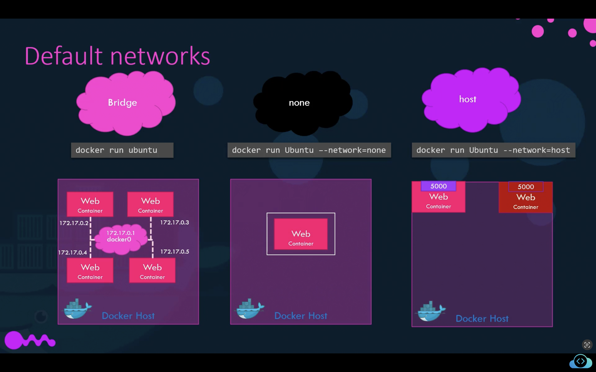
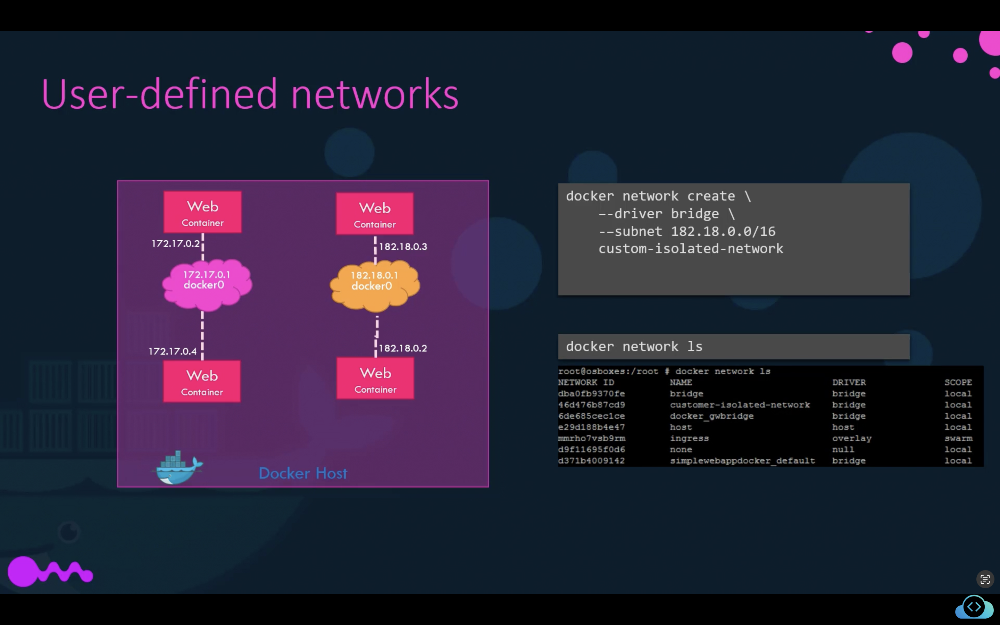

# Concepts and Stuff (improve this)

## Docker Engine

Composed of:

- Docker CLI
- REST API
- Docker Daemon

It uses namespaces to isolate containers.

## Namespaces

A linux system os composed of a set of process ids (`pid`s) and a container
is the same. To differentiate and effectively isolate the system (host)
from the subsystem (container) `pid`s is the task of namespaces.

Every `pid` in the host system has the container `pid` and you can find it
with a `grep` command. Example:

```bash
docker run -d --rm -p 8888:8080 tomcat:9.0
docker exec <CONTAINER_ID> ps -eaf # this will give you an pid
ps -eaf | grep docker-java-home # this will give you another pid
```

## Deep dive into the `docker run -it`

The idea behind it is that the `-i` is the interactive mode and allows you to map
the standard input of your host to the docker container.
Example: if you run an app that asks you for your name and prints it, it will
print the default name, but not allow you to have access to the terminal for your
to input.

To solve the problem of not having access to the terminal, we use the `-t` is to
attach the application `tty` to the container's terminal. Then in the last example
you'll be able to access the terminal prompt, because the `tty` is also attached,
instead of only the standard input channel.

## Sobre VMs dentro do Docker

Maioria dos containers dos containers rodam em um kernel Linux, o que significa
que quando você instala o desktop Docker ou algumas das formas alternativas de
rodar containers, estas ferramentas normalmente gerenciarão uma VM local rodando
um pequeno kernel Linux e um pequeno sistema de arquivos de containers.

Portanto, uma das grandes coisas que o Docker Desktop fará por você é gerenciar
a configuração, a atualização da segurança e, em seguida, a exclusão
daquela pequena VM, tudo isso para você de forma transparente em segundo plano.

## Images and Layers

- Images are made up of file system changes and metadata
- Each layer is uniquely identified and store only once on a host
- A container is a single read/write layer on top of the image
- The container layer is a new, writeable layer, on top of the image layer.
- [Copy-on-write](https://adaptive.svbtle.com/fundamentals-of-docker-storage)
is the technique that employs diffs from images to optimize storage and speed

### Copy-on-write

Consider two boxes: the image box and the container box.

The container box is the built image. The container box is the process.
You interact with the container, not the image, because the container
is who run processess.

Anytime you want to modify a file from the image, instead of modifying the file
inside the image and having to rebuild the whole container, you copy that file
into the container box. That's Copy-on-write.

**Remember that this file does not persist, unless you mount it outside your container.**

## Docker Networks

When you install docker, it automatically creates 3 networks:

- bridge: all containers are attached to it by default (default network).
  - it is a private, internal network created by the host.
  - they get an internal IP address usually around `172.17.____` series.
  - the containers can access each other.
  - to access any of those containers from the **outside world**:
    - map the ports of the containers to the ports on the docker host.
- none:
  - not attached to any network, no access to external networks or
other containers.
    -Ran in an isolated network.
- host: removes the isolation between host and container network
  - in this case if you run an app on port 5000, you don't need
    to match ports, it will be automatically available at port 5000.
    - also means you won't be able to run multiple web containers
    on the same host, on the same port, as the ports are now common
    to all containers in the host.

- **gold tip**: all containers in a docker host can resolve each other
with the name of the container!
  - works because docker has a built-in DNS server that resolves
    each other using container name.
  - the built-in server always runs at address `127.0.0.11`

If you would like to attach the container to any of these
networs, use the `--network=desired_network` flag.



Extra tips:

- Containers shouldnt rely on IPs for intercomunnication as the containers
lifetimes are so volatile. Use DNS instead.
- DNS for friendly names in built-in if you use custom virtual Networks.
- To find what is the subnet configured on bridge network:
`docker network inspect bridge` and look for `Subnet`

## User Defined Docker Networks



## Anonymous vs Named Volumes in Docker-Compose

If you look into the `drupal` image in dockerhub (as of 28/10/2022) you'll see this:

```yaml
services:

  drupal:
    image: drupal:8-apache
    ports:
      - 8080:80
    volumes:
      - /var/www/html/modules
      - /var/www/html/profiles
      - /var/www/html/themes
```

Those are anonymous volumes, which means they're not named. Remember that we can
name volumes by doing this:

```yaml
services:

  drupal:
    image: drupal:8-apache
    ports:
      - 8080:80
    volumes:
      - modules:/var/www/html/modules
      - profiles:/var/www/html/profiles
      - themes:/var/www/html/themes
```

One cool feature of docker is that a new anonymous volume will be initialized
with the existing content of the image at the same location, and so there's no
need in this case to name volumes.

## Bind Mount

This is what makes local development inside containers possible.
Binding mounts is just mapping a host file/dir to a container file/dir,
which synchronizes them (but the if the container is deleted, the host file is preserved).

There's just one catch here: is that you have to either use docker-compose or
run it with `docker container run ....`, you **can't** use a Dockerfile for this.
For example the command bellow synchronize (map) files from the current directory
the `/usr/share/nginx/html` directory.

```bash
docker container run -d --name nginx -v $(pwd):/usr/share/nginx/html nginx
```

## Registry

Registry is just an image. To host our own registry, here we're using
the open source Docker Registry.

To run/create a registry server with name equals to `my-registry` using `registry:2`
image with host port set to 5000, and restart policy set to `always`:

```bash
# create the registry image
docker run -d -p 5000:5000 --restart=always --name my-registry registry:2
```

To push images to the registry:

1. Pull/create the image: `docker pull nginx:latest`.
2. Tag the image: `docker image tag nginx:latest localhost:5000/nginx:latest`.
3. Push the image: `docker push localhost:5000/nginx:latest`.

- Tip: To check the list of images pushed , use `curl -X GET localhost:5000/v2/_catalog`.

## Tips

- About `tags`: they're simply pointers to an image ID.

- Always pin your product image version to the patch level!!

## Geral

- Docker Engine == OCI container runtime ([OCI](https://opencontainers.org/))
